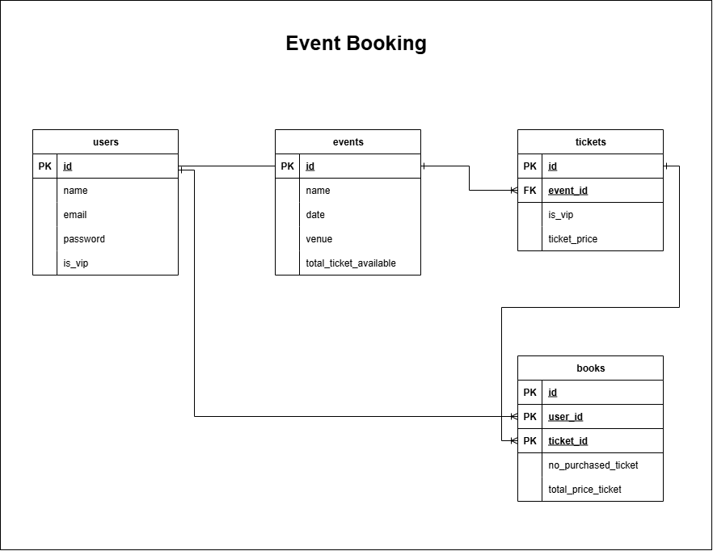

# Event Booking (e-Ticketing System for Event)

This is a simple e-ticketing system built with Laravel 12 for event booking purposes. It supports VIP access within 24 hours, basic validation, and booking cancellation.

## Features

- Create events - Event Organizer
- List available events - Customer & VIP
- Book tickets (24 hours earlier) - VIP
- Cancel booking and restore ticket count - Customer & VIP

## Tech Stack

- Laravel 12 (RESTful API)
- PHP 8.x
- MySQL
- Xampp
- Postman (Testing endpoint)

## Installation
Follow these steps to run the project on your local machine.

1. Clone project & navigate to folder
```bash
git clone https://github.com/azlinliana/event-booking.git
cd event-booking
```

2. Install dependencies
```bash
npm install && npm run build
```

3. Setup environment
```bash
cp .env.example .env
php artisan key:generate
```

4. Configure DB in .env
```bash
DB_CONNECTION=mysql
DB_HOST=127.0.0.1
DB_PORT=3306
DB_DATABASE=event-booking
DB_USERNAME=root
DB_PASSWORD=
```

5. Run migration with seeder
```bash
php artisan migrate --seed
```

6. Serve project
```bash
composer run dev
``` 

## Entity Relationship Diagram (ERD)


